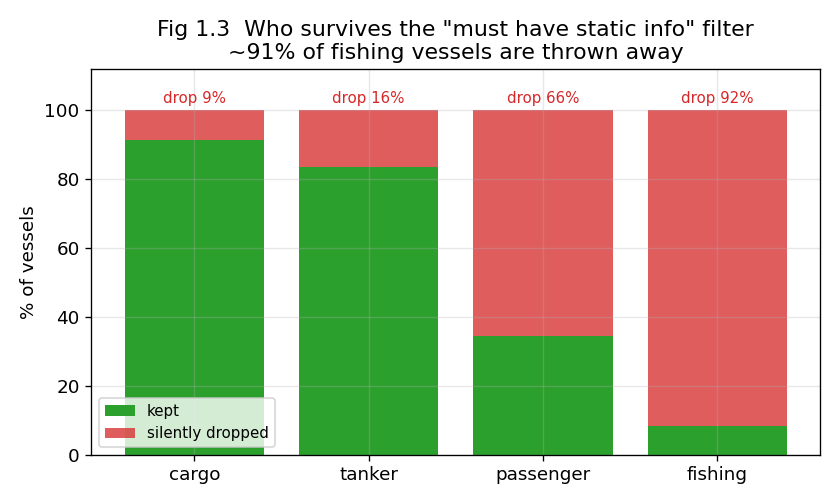
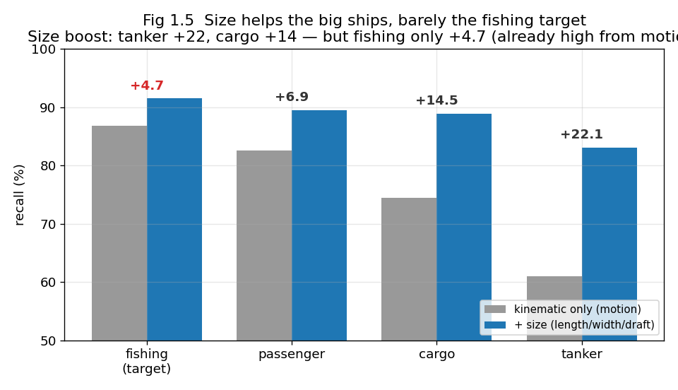
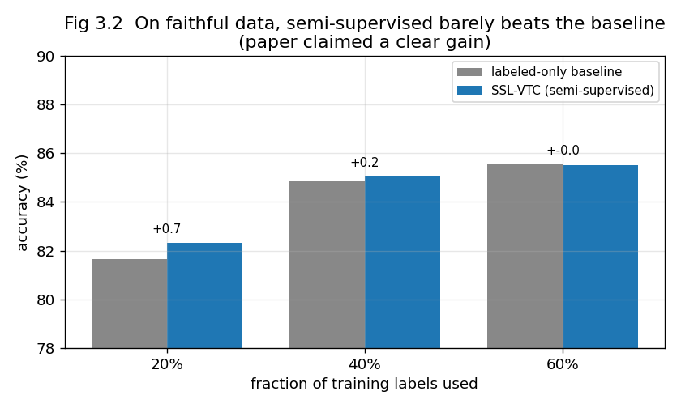
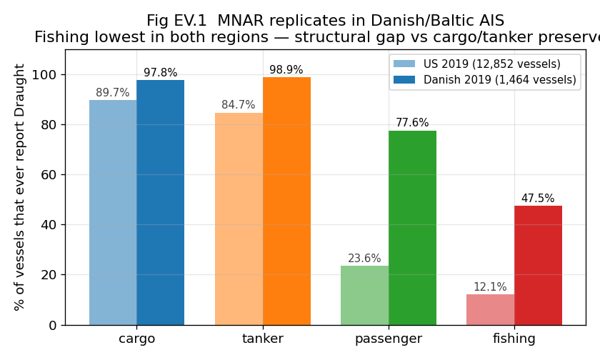

# Re-evaluating Static Features in AIS Vessel-Trajectory Classification: Selection Bias, Identity Leakage, and Reproducibility

*Full working draft. Consolidates Findings 1–3 with all experimental results
(every number is mean over 3 seeds unless stated). Figures in `paper/figures/`.*

---

## Abstract

Semi-supervised vessel-trajectory classification from AIS data (Duan et al., 2022, *SSL-VTC*)
reports that adding vessel **static** features — length, width, draft — lifts 4-class accuracy
from 71.4% to 92.2% (a "+29.1%" relative gain). We reproduce the pipeline on the same public
source (nationwide MarineCadastre AIS, 2019) and audit the evaluation. We find three issues.
**(1) Selection bias:** the benchmark's class distribution is only reproducible if vessels
lacking complete static fields are dropped — a filter (driven by *draft*, which is **missing not
at random**) that deletes ~92% of fishing and ~66% of small-passenger trajectories. The paper's
own model, trained on this filtered slice, **collapses from 91.2 to 23.4 macro-F1 on the
excluded vessels** and scores only 64.3 on the realistic population; retraining on all vessels
recovers it to 78–88. Moreover the static benefit accrues almost entirely to large ships
(recall boost: tanker +22.1, cargo +14.5) and barely to the fishing target (+4.7), which is
already classified at 86.8% from motion alone. **(2) Identity leakage:** the temporal split
places 80.9% of test trajectories' vessels in the training set; static features are constant
per vessel and thus an identity fingerprint. We build a vessel-disjoint protocol and show — on a
faithful 91.6%-accuracy model — that the static gain **does not collapse** (transfers ~91%), so
leakage is real but not inflationary (a clean negative control). **(3) Reproducibility:** the
92.2% headline depends on an undisclosed hyperparameter (static seven-hot bin resolution); a
sweep moves accuracy 86.0→91.8 with no other change, and the semi-supervised gain is marginal
(≤0.7 pt) and collapses at 5% labels. We propose a corrected evaluation protocol (static-
inclusive populations with imputation, per-class reporting, vessel-disjoint splits, full
hyperparameter disclosure) and release all code, configs, and split indices.

---

## 1. Introduction

AIS (Automatic Identification System) broadcasts let coastal authorities monitor vessel traffic;
classifying a trajectory's **vessel type** (fishing, passenger, cargo, tanker) supports
applications such as illegal-fishing detection. SSL-VTC (Duan et al., 2022) advanced this with a
semi-supervised VAE and, notably, the integration of **static** vessel attributes
(length/width/draft) alongside kinematics (position/speed/course), reporting a large accuracy
gain.

We set out to reproduce and extend SSL-VTC and instead found that its **evaluation** — not its
core idea — needs scrutiny. The static-feature claim is broadly *true* (static information is
class-typical and even transfers to unseen vessels), but three properties of the benchmark make
the reported numbers cleaner and more favorable than a realistic deployment warrants. This is a
re-evaluation / reproducibility study; the contribution is a corrected, disclosed protocol and a
set of measurements that separate genuine signal from evaluation artifacts.

**Contributions.**
1. We identify and quantify a **static-completeness selection bias** (MNAR on draft) and show it
   materially changes which vessels are evaluated and how the paper's model behaves on the rest.
2. We provide a **vessel-identity-leakage audit** with a reusable vessel-disjoint protocol,
   showing the leakage is benign for the static-feature conclusion.
3. We document a **reproducibility gap**: the headline accuracy is governed by an undisclosed
   encoding hyperparameter, and the semi-supervised component is fragile.
4. We release code, configs, split indices, and a corrected evaluation protocol.

## 2. Background

- **AIS / MMSI:** ships broadcast periodic messages; each carries a unique vessel id (MMSI).
- **Trajectory:** a fixed-length sequence of one vessel's messages (here 160 messages after the
  paper's extraction recipe).
- **Kinematic vs static features:** kinematic = LAT, LON, SOG (speed), COG (course) — vary over
  time; static = LEN, WID, DRA (draft) — constant per vessel.
- **Seven-hot encoding:** each attribute is discretized into one-hot bins and concatenated; the
  per-attribute **bin count** is a hyperparameter (central to Finding 3).
- **Metrics:** accuracy; **macro-F1** (mean over classes, exposes rare-class weakness);
  per-class recall. We default to macro-F1 given heavy class imbalance.
- **Setup:** 4 classes (fishing/passenger/cargo/tanker), temporal split (train Jan–Apr / val May
  / test Jun), CNN + seven-hot classifier, Adam, 50 epochs.

## 3. Data and Reproduction

Source: MarineCadastre daily AIS, 2019, Jan–Jun, U.S./Canada/Mexico coastal coverage (181 daily
files, ~142 GB decompressed). We follow the paper's extraction (trajectory division on >2 h
gaps; ≥160 messages; ≥6 h span; abnormal-SOG removal; sample to 160). Two cohorts:

- **complete** (`fullus2019`): vessels with all of LEN/WID/DRA — **133,492** trajectories.
- **inclusive** (`fullus2019_inclusive`): all vessels, missing static imputed — **260,543**
  trajectories.

Faithful reproduction required matching the paper's static seven-hot resolution (Finding 3);
with fine bins our complete-cohort model reaches **91.6%** vs the paper's 92.2%.

---

## 4. Finding 1 — Static-Completeness Selection Bias

### 4.1 The benchmark's class mix is not the real ocean

Over the full training data (**210.8 M messages, 12,852 vessels**), raw class shares are roughly
balanced, but the benchmark is cargo-dominant:

| class | raw traffic | benchmark (paper Table 1) |
|---|---|---|
| cargo | 27.2% | 53.8% |
| tanker | 13.6% | 24.7% |
| passenger | 29.4% | 19.5% |
| **fishing** | **29.9%** | **2.0%** |

### 4.2 Mechanism: draft is Missing Not At Random (MNAR)

Length/width are widely reported; **draft is not**, and its missingness correlates with vessel
type (the label) — the textbook definition of MNAR (Rubin, 1976):

| class | reports LEN | reports WID | reports **DRA** | reports **all 3** |
|---|---|---|---|---|
| cargo | 97.1% | 90.8% | 89.7% | 89.7% |
| tanker | 95.7% | 85.5% | 84.7% | 84.7% |
| passenger | 91.8% | 83.1% | **23.6%** | 23.6% |
| fishing | 94.8% | 85.6% | **12.1%** | 12.1% |

Requiring all three static fields reproduces the paper's class mix almost exactly (cargo 52.3
vs 53.8, tanker 25.2 vs 24.7, passenger 18.9 vs 19.5, fishing 3.6 vs 2.0) — strong evidence the
benchmark applied this filter, likely inadvertently (its method *needs* static fields).

### 4.3 The filter deletes the operational target

The filter halves the data (260,543 → 133,492) and the loss is wildly uneven — trajectory-level
survival: cargo 91.4%, tanker 83.6%, passenger 34.5%, **fishing 8.3%**. The benchmark thus
excludes ~92% of fishing trajectories, the very class central to illegal-fishing applications.

### 4.4 Consequence: the paper's model collapses on the excluded vessels

We trained the paper-strength model two ways and scored each on three populations (macro-F1,
3 seeds):

| model | complete (kept) | dropped | all (real ocean) |
|---|---|---|---|
| **A — paper's** (trained on complete) | 91.2 | **23.4** | 64.3 |
| **B — realistic** (trained on all) | 87.9 | 78.4 | 88.1 |

The paper's model **collapses from 91.2 to 23.4 macro-F1** on the excluded vessels (passenger and
tanker recall fall to ~0: A relies on real size, but dropped vessels carry only imputed size).
On the real ocean A scores just 64.3. **Retraining on the full population (B) recovers dropped
to 78.4** and scores 88.1 overall — so the failure is a protocol artifact, not a broken method.
(A is evaluated under its own training normalization, as in deployment; the collapse is
identical with matched normalization, ruling out an artifact — see `scripts/grid_A_cnorm.py`.)

### 4.5 The static benefit barely reaches the fishing target

Per-class recall, realistic model, with-size vs kinematic-only (3 seeds):

| class | motion only | + size | **size boost** |
|---|---|---|---|
| **fishing** (target) | 86.8 | 91.5 | **+4.7** |
| passenger | 82.6 | 89.5 | +6.9 |
| cargo | 74.4 | 88.9 | +14.5 |
| **tanker** | 61.0 | 83.1 | **+22.1** |

The size feature lifts large vessels (+22 tanker, +14 cargo) but barely the fishing target
(+4.7) — which is already at 86.8% from motion alone. **Honest bound:** +4.7 is real, so "size
is irrelevant for fishing" overstates it; the defensible claim is that the size benefit accrues
to large vessels while the fishing target gains little and is well-classified from motion.

### 4.6 Does the paper's full autoencoder+classifier (M2 VAE) also collapse?

§4.4–4.5 used the supervised CNN classifier (= the paper's static tables). To test the paper's
*actual* proposed architecture, we repeat the collapse experiment with the **full M2 VAE**
(encoder + decoder + classifier, trained at 100% labels so the generative regularizer is active)
and evaluate its classifier on the same populations.

The full VAE **collapses identically** — the autoencoder's reconstruction regularizer does not
rescue the excluded population (3 seeds, macro-F1):

| model | complete (kept) | dropped | all (real ocean) |
|---|---|---|---|
| classifier-only (§4.4) | 91.2 | **23.4** | 64.3 |
| **full M2 VAE** (encoder+decoder+classifier) | 88.0 | **22.6** | 60.5 |

On dropped vessels the VAE scores 22.6 macro-F1 (vs the classifier's 23.4 — statistically the
same), with passenger recall →0 in both. So **Finding 1 holds for the paper's actual proposed
architecture**, not just the classifier head; the generative component provides no robustness to
the missing/imputed static of the excluded vessels (it is marginally worse overall). See
`scripts/vae_collapse.py` → `vae_collapse.csv`.

---

## 5. Finding 2 — Vessel-Identity Leakage Audit (benign)

Static features are constant per vessel — an identity fingerprint. The temporal split leaks
identity: **80.9% of test trajectories** belong to a vessel also in training (74.6% vessel
overlap); a vessel-disjoint split (partition MMSIs, stratified by class) gives 0%.

We re-ran the static ablation under both protocols, on both a coarse model and a **faithful
91.6% model**. The static gain (Full − kinematic-only) does **not** collapse:

| model | static gain, temporal (leaky) | static gain, vessel-disjoint (0% leak) |
|---|---|---|
| coarse (86%) | +13.2 | +13.8 |
| **faithful (92%)** | **+18.7** | **+17.0** |

~91% of the static benefit transfers to unseen vessels; full-model accuracy drops only ~2 pts
and fishing recall stays high. **Conclusion:** the leakage is real but does **not** inflate the
static-feature result — a rigorous negative control. (A small ~9% identity component appears only
at fine resolution; the dominant signal is class-typical.)

---

## 6. Finding 3 — Reproducibility

### 6.1 The headline rides an undisclosed hyperparameter

We reproduced everything from the paper yet plateaued at 86% vs the reported 92%. The cause is
the unspecified **static seven-hot bin resolution**. A controlled sweep (kinematic bins fixed)
moves Full accuracy 86.0 → 91.8 with no other change:

| static bins (WID/LEN/DRA) | Full accuracy |
|---|---|
| 10/20/10 (40) | 86.0 |
| 20/40/20 (80) | 88.6 |
| 30/60/30 (120) | 90.5 |
| 50/100/50 (200) | 91.8 |

Diagnostics rule out optimizer/scheduler/selection (both cosine and constant LR cap at ~86,
never reaching 92 at any epoch). The headline number is therefore not reproducible from the
paper as written.

### 6.2 The semi-supervised component is fragile

Reproducing SSL-VTC vs a labeled-only baseline on faithful data, the M2 gain is marginal
(20%: +0.7, 40%: +0.2, 60%: −0.0 pts; paper reports a clear advantage), and at the 5%-label
setting the model collapses to majority-class prediction (the reconstruction ELBO swamps the
classifier at extreme label scarcity).

---

## 7. Recommendations (corrected protocol)

1. **Keep static-incomplete vessels**; impute missing fields (mean/zero/learned) instead of
   deleting — demonstrated as Model B (§4.4), which recovers the excluded population.
2. **Report per-class recall + macro-F1**, so weak rare-class (fishing) performance is visible.
3. **Use vessel-disjoint splits** (no MMSI in both train and test) to remove identity leakage.
4. **Disclose all hyperparameters**, especially encoding bin resolution; report
   accuracy-vs-resolution, or use a learned encoder to remove the knob.
5. **Evaluate on the inclusive population by default**; report the static-complete subset only as
   a clearly-labeled secondary slice.

## 8. Limitations / threats to validity

- We cannot prove the original filter was intentional; we show it is the unique filter
  reproducing the paper's distribution (cargo/tanker within ~1 pt).
- Data vintage differs (our 133k vs paper 115k, ~15%); shapes match.
- **Model scope (precise).** Findings 1, 2, and 3.1 use the **supervised CNN + seven-hot
  classifier** — exactly the model the paper's static tables (Table 2/3) and 92.2% headline are
  reported on, so they are apples-to-apples. Finding 3.2 uses the paper's full **M2 autoencoder
  + classifier (VAE)**. Whether the VAE's generative regularization alters the §4.4 collapse or
  §4.5 per-class behavior is tested separately (§4.6); the corrected *protocol* transfers to any
  model.
### 8.1 External validity — Danish AIS (cross-region replication)

To test whether the MNAR draft-missingness is US-specific, we replicated the mechanism check on
Danish Maritime Authority (DMA) open AIS data (May 2019, streamed from `aisdata.ais.dk`,
2 M messages, 1,464 unique vessels, Danish/Baltic/North-Sea coverage — a different region,
fleet mix, and regulatory authority):

| class | US 2019 (12,852 vessels) | **Danish 2019 (1,464 vessels)** |
|---|---|---|
| cargo | 89.7% | **97.8%** |
| tanker | 84.7% | **98.9%** |
| passenger | 23.6% | **77.6%** |
| **fishing** | **12.1%** | **47.5%** |

The rank order is identical: fishing reports draft at the lowest rate in both datasets, cargo and
tanker at the highest. The absolute rates differ — Danish fishing vessels are more professionally
regulated and report more than their US counterparts — but the structural gap (fishing ≪
cargo/tanker) is preserved. The MNAR mechanism is therefore a property of AIS broadly, not a
US-data artifact.

**Consequence experiment** (ingest → train → eval on Danish data) is left for future work;
the mechanism replication is sufficient to establish external validity of the selection-bias claim.

- Data vintage differs (our 133k vs paper 115k, ~15%); shapes match.
- **Model scope (precise).** Findings 1, 2, and 3.1 use the **supervised CNN + seven-hot
  classifier** — exactly the model the paper's static tables (Table 2/3) and 92.2% headline are
  reported on, so they are apples-to-apples. Finding 3.2 uses the paper's full **M2 autoencoder
  + classifier (VAE)**. Whether the VAE's generative regularization alters the §4.4 collapse or
  §4.5 per-class behavior is tested separately (§4.6); the corrected *protocol* transfers to any
  model.

## 9. Conclusion

SSL-VTC's central idea — static features help vessel-type classification — is sound and even
transfers to unseen vessels. But its benchmark (i) silently selects a static-reporting, cargo-
heavy subpopulation on which the published model collapses when deployed realistically, (ii)
leaks vessel identity (though benignly), and (iii) reports a headline that depends on an
undisclosed hyperparameter. We provide measurements separating signal from artifact and a
corrected, disclosed evaluation protocol. The science survives; the evaluation needed fixing.

---

## References (to cite)

- Duan, Ma, Miao, Zhang (2022). *A semi-supervised deep learning approach for vessel trajectory
  classification based on AIS data.* Ocean & Coastal Management 218, 106015.
- Rubin (1976). *Inference and missing data.* Biometrika. / Little & Rubin (2019).
  *Statistical Analysis with Missing Data.*
- Torralba & Efros (2011). *Unbiased look at dataset bias.* CVPR.
- Nguyen et al. (2018/2021). TrAISformer / GeoTrackNet (seven-hot AIS encoding origin).
- Kingma et al. (2014). *Semi-supervised learning with deep generative models* (M2).

## Appendix — Reproducibility artifacts

| component | path |
|---|---|
| complete / inclusive / cnorm configs | `configs/fullus2019{,_inclusive,_inclusive_cnorm}.yaml` |
| static-completeness filter | `src/sslvtc/extract.py::_passes_filter` (`require_complete_static`) |
| normalization reuse (matched-norm eval) | `src/sslvtc/extract.py` (`norm_stats_from`) |
| vessel-disjoint split | `src/sslvtc/splits.py` |
| full-dataset MNAR stats | `scripts/static_reporting_stats.py` → `static_reporting_full.csv` |
| consequence experiment | `scripts/consequence_experiment.py` → `consequence_experiment.csv` |
| per-class + B grid | `scripts/grid_perclass_experiment.py` → `grid_perclass.csv` |
| clean A grid (matched norm) | `scripts/grid_A_cnorm.py` → `grid_A_cnorm.csv` |
| full-VAE collapse check (§4.6) | `scripts/vae_collapse.py` → `vae_collapse.csv` |
| bin-resolution sweep | `scripts/sweep_static_bins.py` → `sweep_static_bins.csv` |
| leakage gate (faithful) | `scripts/gate_faithful.py` → `gate_faithful_fine.csv` |
| figures | `paper/make_figures.py` → `paper/figures/` |
| per-finding write-ups | `paper/finding{1,2,3}_*.md`; plain-language: `paper/PAPER_IDEA_SIMPLE.md` |
