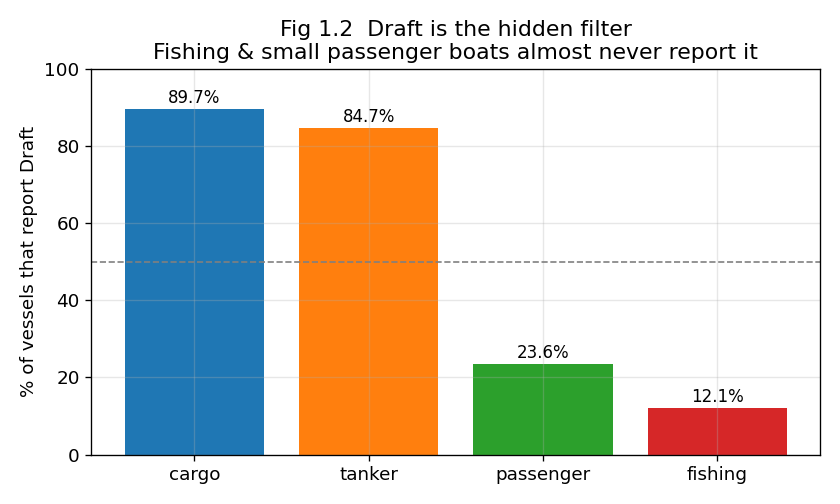
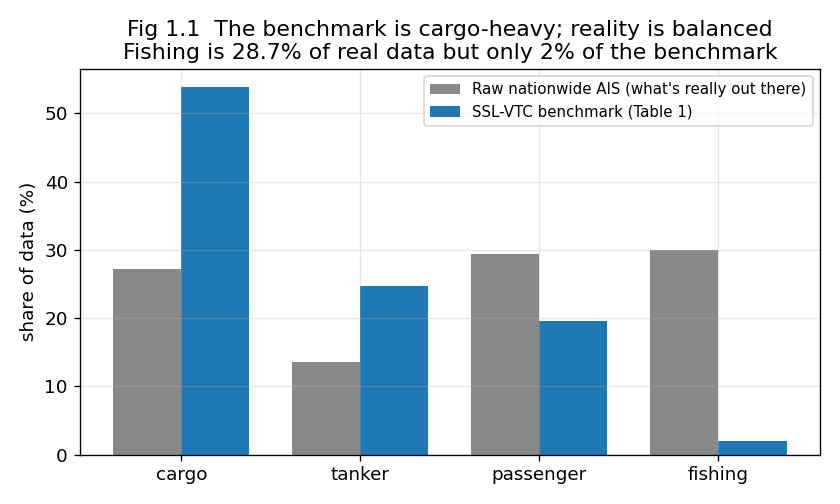
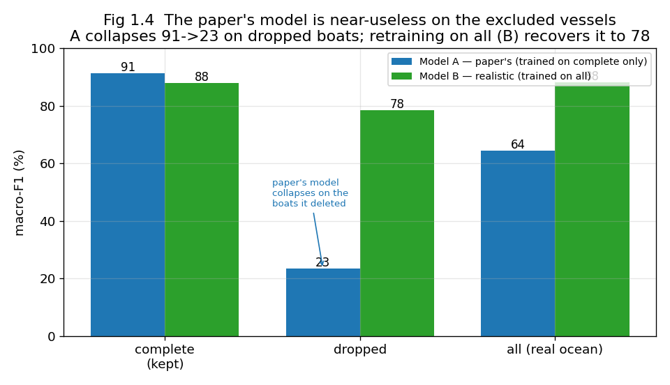
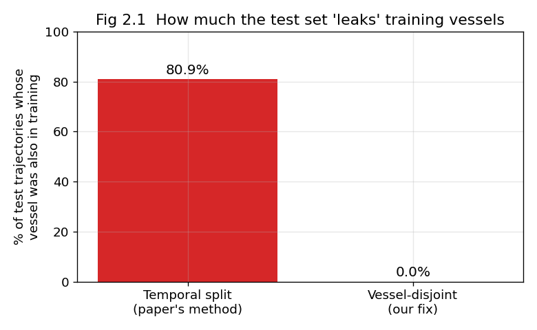
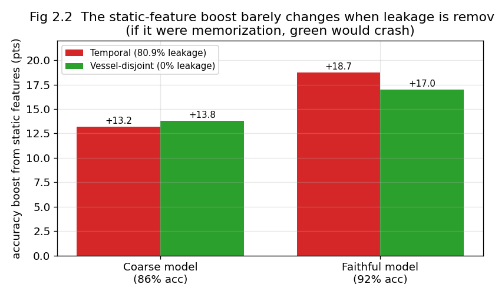
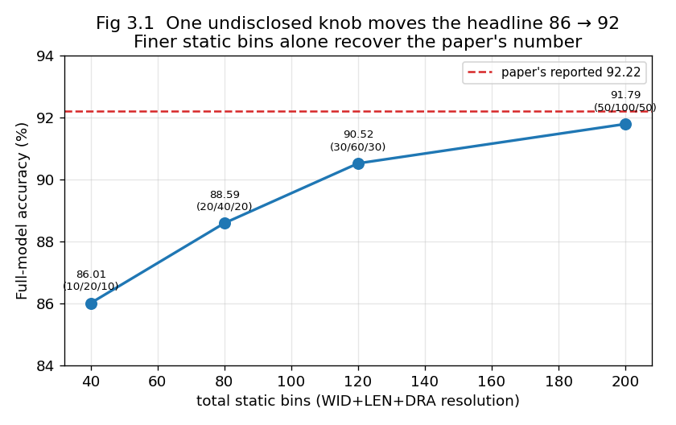

# The Paper, Explained Simply

*For someone who knows basic maths (percentages, averages, reading a bar chart) and nothing
about ships or machine learning. No special background needed.*

---

## The one-sentence idea

A well-known study says "if you tell a computer how big a ship is, it gets much better at
guessing what kind of ship it is." We re-did their work carefully and found that the claim is
**true**, but the way they *tested* it has three hidden flaws that make the result look better
and cleaner than it really is. Our paper documents those flaws and shows how to test it fairly.

---

## Step 1: What is the problem the original study solves?

Ships constantly broadcast little radio messages saying where they are, how fast they're going,
and some facts about themselves (their length, width, and "draft" = how deep they sit in the
water). This system is called **AIS**.

The goal: look at a ship's path and the facts it broadcasts, and **guess what type of ship it
is** — fishing boat, passenger ferry, cargo ship, or oil tanker. A computer program (a "model")
learns to do this from lots of examples.

The original study's claim: if you feed the model the ship's **size** (length/width/draft), not
just its movement, the guesses jump from **71% correct to 92% correct**. Big improvement. That's
their headline.

We checked whether that headline is trustworthy. It mostly is — but the *testing* has problems.

---

## A tiny bit of vocabulary (that's all you need)

- **Model**: the computer program that makes the guess.
- **Training**: showing the model many examples so it learns.
- **Testing**: giving it new examples and counting how many it gets right.
- **Accuracy**: the percentage it gets right.
- **The catch about size:** a ship's size never changes. So size is like a *fingerprint* — it
  can identify a *specific* ship, not just its type. Keep that in mind for Flaw #2.

---

## Flaw #1 — They tested on a hand-picked crowd (the main finding)

To use a ship's size, you need the ship to actually broadcast its size. It turns out **small
boats usually don't broadcast their draft** (how deep they sit). Big commercial ships almost
always do.

- Cargo & tankers: broadcast draft ~85–90% of the time.
- Fishing boats: only **12%** of the time.
- Small passenger boats: only **24%**.

The original study only kept ships that broadcast their full size. **That quietly deleted almost
every fishing boat.** In the real ocean, fishing boats are ~30% of traffic; in their test set,
they're 2%. We checked: roughly **92% of fishing boats get thrown away** by this rule.

So the model was tested on an easier, lopsided crowd (mostly big ships), and nobody mentioned
the deletion happened.

**Does it actually matter?** We re-ran the test two ways: (A) their way (only ships with full
size), and (B) the honest way (keep everyone, and when size is missing, just fill in the average
size). Result:

- The honest test scores about **3 points lower** — so their number is a bit too rosy.
- The boats they deleted are about **9 points harder** to classify — so they hid the hard part.

It's not a disaster (the model doesn't fall apart), but the test was made easier than reality,
and that was never disclosed. **This is our main contribution.**

There's even a proper statistics name for this: the data is **"Missing Not At Random"** —
whether the size is missing depends on the very thing you're trying to predict (the ship type).
That's the kind of missing data you can't just delete safely.

---

## Flaw #2 — The exam reused the study questions (we checked; it's OK)

Imagine studying for an exam, and the exam turns out to contain the exact same questions you
practised on. You'd score high — but it wouldn't prove you learned anything.

The original test split data **by time** (train on Jan–Apr, test on June). But a ship sailing in
both April and June ends up in *both* the study set and the exam. We measured this: **81% of the
test ships were also in the training set.** And remember, size is a fingerprint — so the model
*could* just memorize "this exact ship is a tanker" instead of learning "big ships are tankers."

We built a fair version where no ship appears in both, and re-tested. **The score barely changed
(~91% of the benefit survived).** So the model genuinely learned ship *types*, not ship
identities.

 The leakage is real but harmless here. (We report this honestly — it's a "we checked
the obvious worry and it's fine" result, which is valuable on its own.)

---

## Flaw #3 — A key setting was never written down

The study reports 92% accuracy. We followed their recipe exactly and got stuck at 86%. We
hunted down why: there's a setting — how finely the ship's size is chopped into number-buckets
before the model sees it — that they **never wrote down**. Turning only that knob moves the
score from 86% to 92%. So the famous number can't be reproduced from the paper as written; it
depends on an undocumented choice.

---

## What we propose (the fix)

A fair way to test these ship-type models:

1. **Keep the small boats.** Don't delete a ship just because one field is blank — fill the gap
   in with a sensible value.
2. **Report the score for each ship type separately**, so weak performance on rare types (like
   fishing) is visible instead of hidden.
3. **Split the data so no ship is in both training and testing.**
4. **Write down all the settings**, including the size-bucket one.

We show all of this is practical — we actually ran the fair version.

---

## Why anyone should care

Programs like this are used to **spot illegal fishing** and watch coastal traffic. The ships
that matter most for that — small fishing boats — are exactly the ones the original test quietly
removed. So a model that looks excellent on paper may be weakest precisely where it's needed.
Our paper doesn't tear the method down; it makes the evaluation honest, so the reported numbers
mean what people think they mean.

---

## The takeaway in three lines

1. "Ship size helps classify ships" — **true**, and it even works on ships never seen before.
2. **But** the standard test deletes most small boats, reuses ships between study and exam, and
   hides a key setting — so its headline number is too clean.
3. We measure each problem and give a fair testing recipe. The science survives; the
   *benchmark* needed fixing.
