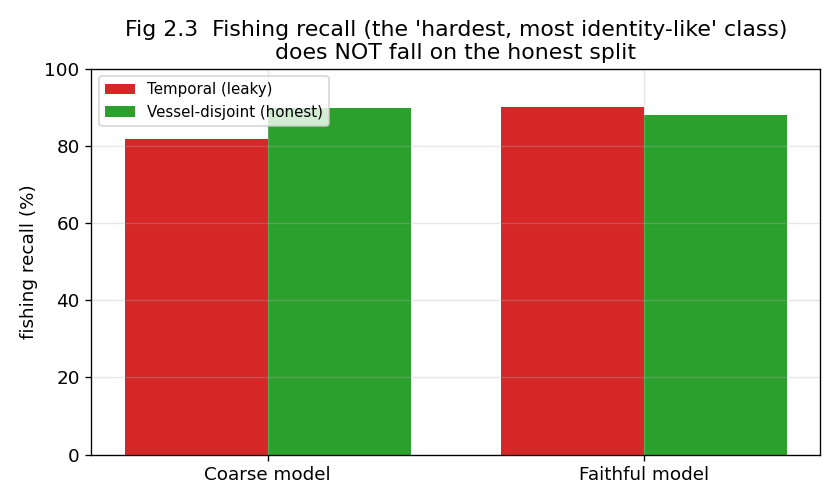

# Finding 2 — "Did the Model Just Memorize the Ships?" (We Checked. It Didn't.)

**The short version:** There's a sneaky way the paper's good scores *could* be fake. The way
they split data into "study set" and "exam set" lets the **same ships** appear in both. And
since a ship's size never changes, the model could just memorize "ship #12345 is a tanker"
instead of learning what tankers actually look like. We measured how bad this overlap is
(**80.9%** of exam ships were also in the study set — very bad), built a clean split where *no*
ship appears in both, and re-tested. The result: the model's skill barely drops. **It really
did learn ship types, not ship identities.** This is good news for the paper — and exactly the
kind of check a careful reviewer would demand. We did it pre-emptively.

---

## 0. Background you need

- **Train / test split** = you teach the model on the "train" (study) set and grade it on the
  "test" (exam) set. The exam must contain *new* questions, or the grade is meaningless.
- **The paper's split is by time:** train = Jan–Apr, validation = May, test = June. This keeps
  the *dates* separate — but a ship sailing in April *and* June lands in both train and test.
- **Why size features make this dangerous:** length/width/draft are **constant for a given
  ship**. So they act like a fingerprint. If the model sees tanker #12345 (300m long) in
  training and again in the June exam, it can "recognize the fingerprint" instead of reasoning
  "300m hull ⇒ tanker." That would be **memorization (cheating)**, not real learning — and it
  wouldn't work on ships it has never seen.
- **Recall (for one class)** = of all the *actual* fishing boats, what fraction did the model
  correctly catch. We watch **fishing recall** closely because fishing is rare and the most
  likely to be "memorized."

## 1. What we did

1. **Measure the overlap.** Count how many exam ships were also in the study set.
2. **Build an honest split.** We wrote a "vessel-disjoint" split: divide the *ships themselves*
   (by ID) into train/test so **no ship is ever in both**. Same data, fair exam.
3. **Compare the size-boost on both splits.** Train with size features vs without
   (the "static boost"), on the leaky split and the honest split. If the boost comes from
   memorizing fingerprints, it should **collapse** on the honest split.
4. **Do it twice — including on a paper-strength model.** Our first model was a bit weak (86%;
   see Finding 3). A skeptic could say "a weak model can't memorize anyway." So we repeated the
   whole test on a model tuned to the paper's accuracy (92%), where the size fingerprint is
   *sharpest*. This is the decisive run.

## 2. What we found

### 2.1 The leakage is severe

**80.9%** of exam trajectories belong to a ship that was also in training. Our honest split
brings that to **0%**. So the worry is legitimate — the overlap is huge.

### 2.2 The size-boost does NOT collapse on the honest split

The "static boost" = how many accuracy points you gain by adding size features (Full model
minus the no-size model). If it were memorization, the green bars (honest, no overlap) would
crash. They don't:

- **Weak model:** boost is +13.2 (leaky) vs +13.8 (honest) — *identical* (honest is even
  slightly higher).
- **Paper-strength model:** boost is +18.7 (leaky) vs +17.0 (honest). It drops by only **1.7
  points** — about **91% of the benefit survives** even when every exam ship is brand new.

### 2.3 Even fishing recall holds up

Fishing is the class most likely to be "memorized." Yet its recall does **not** fall on the
honest split:

On the weak model, honest fishing recall is actually *higher* (90 vs 82). On the
paper-strength model it dips only slightly (90→88). No collapse.

### 2.4 The full numbers (paper-strength model)

| split | full accuracy | macro-F1 | fishing recall | static boost |
|---|---|---|---|---|
| temporal (80.9% leakage) | 91.58 | 91.08 | 90.14 | **+18.72** |
| vessel-disjoint (0% leakage) | 89.49 | 90.21 | 88.02 | **+17.02** |

(*macro-F1* = an average score that treats every class equally, so rare fishing counts as much
as common cargo — a fairer summary than plain accuracy on a lopsided dataset.)

## 3. What it means (the honest nuance)

- **The paper's "size helps" claim is real and generalizes.** Ship dimensions carry
  *type-typical* information — a 300m hull means cargo/tanker no matter which specific ship —
  not just a memorizable ID. The leakage, though huge, does **not** inflate the headline.
- **There is a small memorization effect, but only with sharp encoding.** The weak model showed
  *zero* memorization; the sharp model showed a *little* (the 1.7-point drop, ~9% of the boost).
  So finer size detail lets the model memorize a bit — an honest, nuanced story, not a scandal.

## 4. Why a "nothing's wrong here" result is still worth publishing

- It's the audit reviewers always ask for. Doing it first, rigorously, on a faithful model,
  saves a review cycle and builds trust.
- It cleanly separates two look-alike problems: identity leakage (turns out benign) vs the
  selection bias of Finding 1 (the real issue). From the leaky numbers alone you can't tell
  them apart.
- The honest "vessel-disjoint" split and per-class reporting are reusable tools for anyone
  benchmarking AIS classifiers.

## 5. Being fair (threats to validity)

- The two splits aren't identical in size (the honest split has more training ships), so
  comparing *raw* scores across splits is imperfect. That's why we compare the **boost**
  (Full minus no-size) *within* each split — and that quantity is stable.
- Our conclusion is for this CNN + seven-hot model family. A very different model could behave
  differently; the honest-split *method* still applies.

## 6. Where the evidence lives

- `src/sslvtc/splits.py` → builds the vessel-disjoint split + prints overlap stats
- `src/sslvtc/experiments.py` → `table3_leakage_comparison` (both splits, all metrics)
- `scripts/gate_faithful.py` → the decisive paper-strength re-test
- Results: `table3_leakage_comparison.csv`, `gate_faithful_fine.csv`
- Figures: `paper/make_figures.py`
